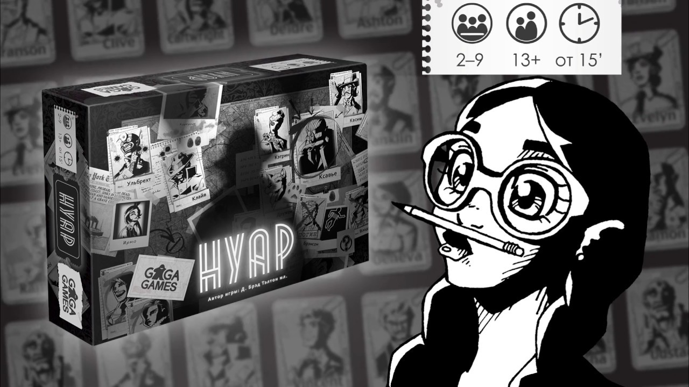

# noir-game
NoirGame — проект по реализации онлайн версии настольной игры «Нуар».

## Состав игры
«Нуар» — это несколько отдельных детективных игр, 
для которых используется единая колода и определенные жетоны. 
Многие из этих игр похожи друг на друга, поэтому первой мы рекомендуем 
освоить игру «Бандит против инспектора» и только уже после этого 
переходить к остальным.

### Варианты игр
* #### Бандит против инспектора
  *2 игрока, 15 минут*

  Сыграйте в смертельные кошки-мышки и выследите бандита, 
прежде чем он доберется до вас.

* #### Убийца против сыщика
  *2 игрока, 20 минут*

  Убийца устраняет людей по списку, а сыщик старается его обезвредить.

* #### Шпионские игры
  *3–6, 8 или 9 игроков, 30 минут*

  Отыщите и поймайте остальных шпионов раньше, чем они поймают вас.

* #### Вор-виртуоз против начальника полиции
  *2 игрока, 60 минут*

  Вор-виртуоз грабит всех, кто попадается ему под руку, но по его 
следу неотступно идет сам начальник полиции.

* #### ФБР против мафии
  *6 или 8 игроков, 45 минут*

  Командная игра, в которой агенты ФБР ловят мафиози, решивших, 
что город принадлежит им.

* #### Ограбление века
  *5, 6 или 7 игроков, 45 минут*

  Группа воров пытается ограбить хранилища казино, а начальник 
безопасности — их остановить.

## Описание процесса игры

TODO
